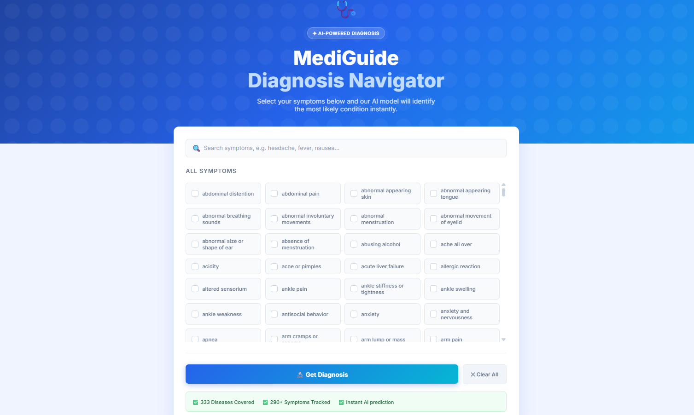
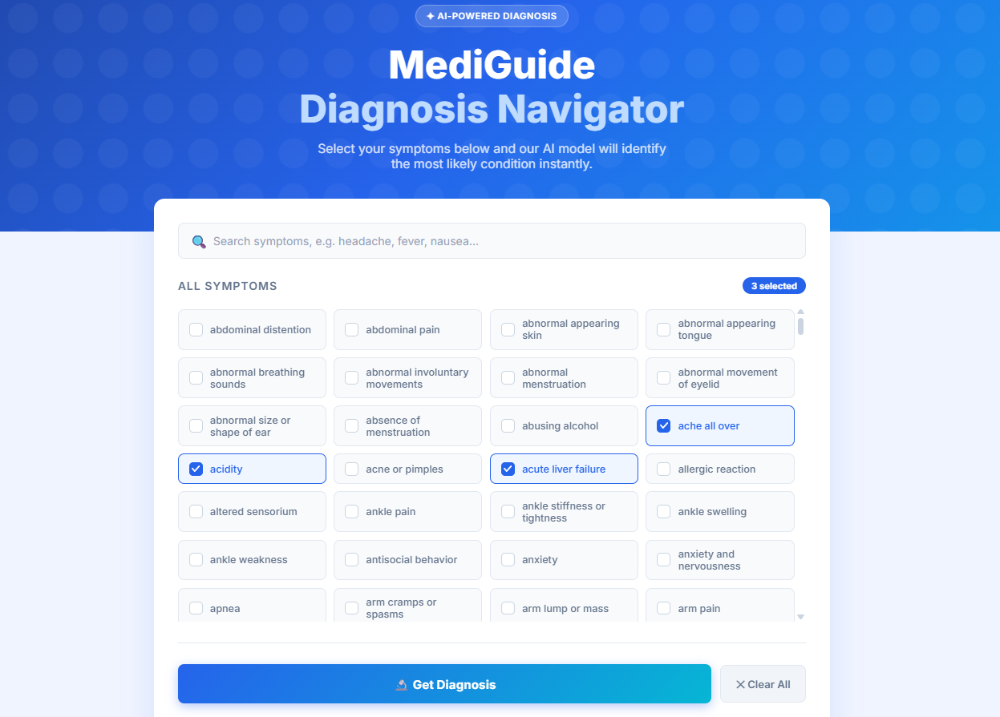
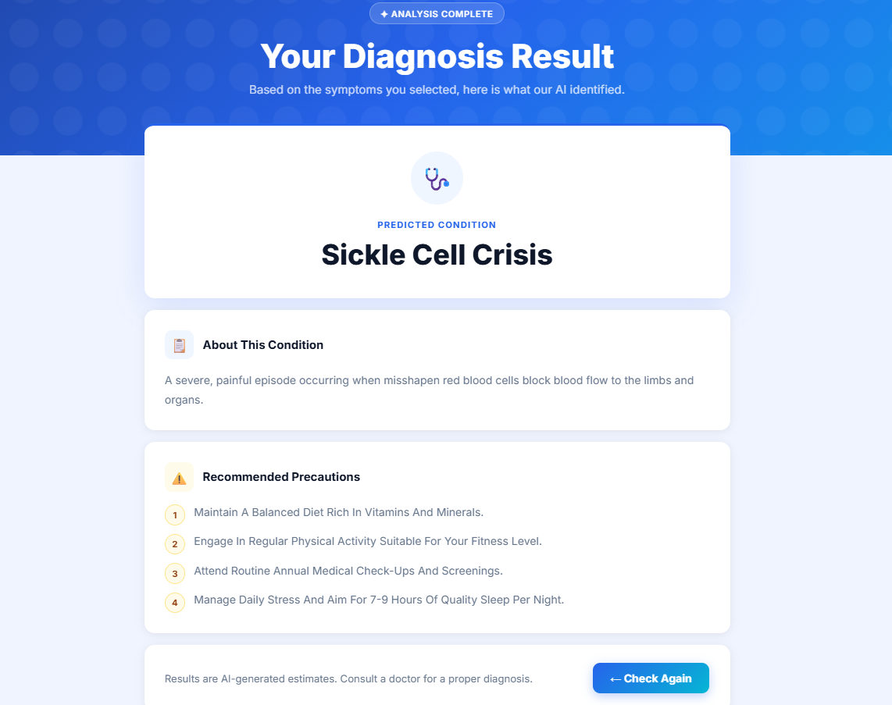

# MediGuide Diagnosis Navigator - Real Time Disease Prediction Web Application

A machine learning-powered web application that predicts diseases based on user-reported symptoms and provides descriptions and precautionary advice using Python, FastAPI and ML Model (RandomForestClassifier).

---

## 🚀 Tech Stack

| Layer | Technology |
|---|---|
| **Backend** | Python, FastAPI |
| **Server** | Uvicorn (ASGI) |
| **Frontend** | HTML, CSS, Jinja2 Templates |
| **Machine Learning** | scikit-learn (RandomForestClassifier) |
| **Data Handling** | pandas, numpy, joblib |

---

## 🧠 How It Works

1. **Training (`Train.py`):** Loads `dataset.csv` (4,921 samples, 41 diseases), maps each symptom to a severity weight, builds a full-vocabulary feature vector, and trains a `RandomForestClassifier`. Saves the model and lookup dictionaries as `.pkl` files.

2. **Serving (`main.py`):** FastAPI loads the pre-trained model and dictionaries at startup. The user selects symptoms from the web UI; the app constructs the feature vector, runs prediction, and returns the disease name, description, and recommended precautions.

---

## ✨ Key Features

- 🩺 **Symptom-Based Prediction:** Select from a comprehensive list of symptoms to receive an AI-driven diagnosis.
- 🎨 **Modern UI:** A clean, responsive, and attractive frontend featuring a gradient aesthetic, custom icons, and real-time symptom search filtering.
- ⚡ **FastAPI Backend:** Built on FastAPI for high performance, modern async routing, and robust error handling.
- 🔄 **Live Content Loading:** Disease descriptions and precautions are loaded dynamically from CSV files at server startup—making updates effortless without requiring model retraining.
- 🎯 **94.75% Accuracy:** Powered by a highly optimized Random Forest Classifier using an extensive feature vector.

---

## ⚙️ Installation & Setup

### 1. Clone the repository
```bash
git clone https://github.com/your-username/mediguide-diagnosis-navigator.git
cd mediguide-diagnosis-navigator
```

### 2. Create and activate a virtual environment
```bash
python -m venv .venv
# Windows
.venv\Scripts\activate
# macOS / Linux
source .venv/bin/activate
```

### 3. Install dependencies
```bash
pip install -r requirements.txt
```

### 4. Train the model (first-time setup)
```bash
python Train.py
```
This generates `trained_model.pkl` and the supporting `.pkl` dictionaries.

### 5. Run the application
```bash
python main.py
```

Open your browser and navigate to:
- **App:** `http://127.0.0.1:8000`
- **Interactive API Docs (Swagger):** `http://127.0.0.1:8000/docs`
- **ReDoc API Docs:** `http://127.0.0.1:8000/redoc`

---

## 🧹 Data Cleaning Pipeline 

To ensure the model is trained on high-quality data, an extensive cleaning pipeline was implemented on the original raw dataset:

1. 📊 **Initial Assessment:** The raw dataset contained **246,945 rows** mapping to **773 unique diseases**.
2. ✂️ **Frequency Filtering:** Removed extremely rare diseases (fewer than 100 records) to prevent overfitting. Reduced the scope to **443 reliable diseases**.
3. 🔍 **Duplicate & Ambiguity Resolution:**
   - Eliminated **51,028** exact duplicate rows.
   - Identified and removed **12,193** ambiguous patterns *(the exact same combination of symptoms mapping to entirely different diseases)*.
4. ✅ **Final Dataset:** The strict cleaning process yielded a highly reliable `cleaned dataset.csv` containing **148,755 rows** and **333 distinct diseases**, ensuring the Random Forest model learns clear, unambiguous clinical boundaries.

---

## 📁 Project Structure

```
FlaskITER/
├── main.py                   # FastAPI application (entry point)
├── Train.py                  # Model training script
├── requirements.txt          # Python dependencies
│
├── cleaned dataset.csv               # Raw training data
├── Symptom-severity.csv      # Symptom → severity weight mapping
├── symptom_Description.csv   # Disease descriptions (source CSV)
├── symptom_precaution.csv    # Disease precautions (source CSV)
│
├── trained_model.pkl         # Trained RandomForest model
├── symptom_to_int.pkl        # Symptom → feature index mapping
├── symptom_weights.pkl       # Symptom → weight mapping
├── disease_descriptions.pkl  # Disease → description mapping
├── disease_precautions.pkl   # Disease → precautions mapping
│
└── templates/
    ├── index.html            # Symptom selection UI
    └── result.html           # Prediction results page

```
---
## 📋  Demo

### User Interface



---

### Select Symptoms



---

### Predicted Result



---

## ⚕️ Disclaimer

This tool is for **informational and educational purposes only** and is **not** a substitute for professional medical advice, diagnosis, or treatment. Always consult a qualified healthcare provider.

---

## 🔭 Future Work
### Model & Data
- **Expand the disease database** — The current model covers 41 diseases and 135 symptoms. Future versions could incorporate larger, clinically validated datasets (e.g., ICD-10 coded records) to improve coverage and real-world accuracy.
- **Differential diagnosis** — Show the top 3 predicted diseases ranked by likelihood, not just the single most probable one.
### Features
- **Patient history & session tracking** — Allow users to save past diagnoses and track how their symptoms change over time.
- **Doctor recommendation** — After a prediction, suggest nearby relevant specialists or clinics using a maps API.
- **Multi-language support** — Translate the UI and symptom labels to support non-English speakers.

---

## 👥 Author-Contact

**Mohd Kaif Ansari**<br>
📧 Email: kaifansari1808@gmail.com<br>
🔗 [Linkedin](https://www.linkedin.com/in/mohd-kaif-ansari/)<br>
 